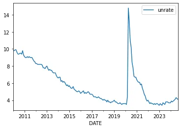
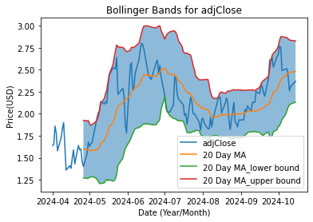

# Time Series for Finance and Economics

Time series analysis is widely used in finance and economics, where historical data is often the best predictor of future trends. Financial markets, economic indicators, and business cycles are all governed by temporal patterns, making time series analysis indispensable for forecasting, risk management, and strategic decision-making. Whether it is predicting stock prices, modeling economic growth, or optimizing investment portfolios, time series methods provide valuable insights for financial analysts, economists, and policy makers.

Financial time series data includes stock prices, exchange rates, commodity prices, interest rates, and bond yields. These time series are typically high-frequency, exhibiting volatility, seasonal effects, and complex dependencies. Modeling financial time series requires specialized techniques that account for non-stationarity, heteroscedasticity (changing variance), and heavy-tailed distributions. Popular models include Autoregressive Conditional Heteroskedasticity (ARCH) and its extension, Generalized ARCH (GARCH), which are used for volatility modeling and risk management.

Economic time series data includes Gross Domestic Product (GDP), inflation rates, employment statistics, trade balances, and other macroeconomic indicators. These time series are often influenced by business cycles, government policies, and global events. Cointegration and Vector Error Correction Models (VECM) are widely used to analyze long-term relationships between economic variables, such as the relationship between inflation and interest rates.

Time series analysis is also fundamental to risk management and portfolio optimization in finance. Value at Risk (VaR) and Conditional Value at Risk (CVaR) are used to quantify financial risks, while portfolio optimization techniques maximize returns while minimizing risk. Scenario analysis and stress testing are employed to evaluate the impact of extreme market conditions.

This chapter provides an in-depth exploration of time series methods for finance and economics. It covers financial time series modeling, economic forecasting techniques, volatility modeling, risk management, and portfolio optimization. It also examines algorithmic trading strategies and high-frequency data analysis. By the end of this chapter, you will have the knowledge and skills to apply time series analysis to complex financial and economic problems, empowering you to make data-driven decisions with confidence.

# Financial Time Series Analysis

Financial time series analysis is a cornerstone of quantitative finance, enabling investors, analysts, and economists to model market dynamics, forecast prices, and manage risks. Financial time series data includes stock prices, exchange rates, commodity prices, interest rates, and bond yields. These time series exhibit unique characteristics, such as volatility clustering, heavy tails, and non-stationarity, requiring specialized modeling techniques.

One of the most important features of financial time series is volatility, which measures the degree of variation in asset prices over time. Volatility is not constant; it tends to cluster, with high-volatility periods followed by more high-volatility periods and low-volatility periods followed by low-volatility periods. This phenomenon is known as volatility clustering and is a defining characteristic of financial markets. Modeling volatility is crucial for risk management, portfolio optimization, and derivative pricing.

Autoregressive Conditional Heteroskedasticity (ARCH) and its extension, Generalized ARCH (GARCH), are the standard approaches for modeling volatility. ARCH models capture time-varying volatility by assuming that the current period's variance depends on the squared residuals from previous periods. GARCH models generalize this by incorporating lagged variances, allowing for more flexible and accurate volatility modeling. These models are particularly useful for financial risk management, as they provide a measure of conditional volatility, helping investors quantify uncertainty.

# Time Series for Unemployment using Prophet and Plotly in Python

This project uses Bayesian time series to predict unemployment in the US. We visualize the data using Plotly. Then we repeat the process using a different dataset---the price of natural gas in the US. The goal is to show how easily we can make time series forecasts without complicated math.

We begin by importing the Python modules needed for this project, using `pandas_datareader` to fetch data from the Federal Reserve Economic Data (FRED). FRED data is free and easily accessible via API.

# Importing and Visualizing Data

We import the data and examine the first five rows. Since the data is univariate and indexed on time, we can use the pandas plot function to make a simple graph: $$`df.plot()`$$ This shows the unemployment rate in the US from January 1, 2010, to October 20, 2024. There is a significant spike from 2020--2021 associated with COVID-19.

# Building a Model with Prophet

To predict unemployment, we use the Prophet model from Facebook, which creates a Bayesian structural time series. The graph shows:

- Actual values (dots)

- Predictive values (blue solid line)

- Predicted range (light blue field)

Prophet requires specific column names: `ds` for date and `y` for the target value:

df.reset_index(inplace=True) df.columns = ["ds", "y"] df.dropna(inplace=True) model = Prophet() model.fit(df) future = model.make_future_dataframe(periods=12)

This creates a forecast for the next 12 months. In the graph, the unemployment rate values are dots, the dark blue line is the Prophet forecast, and the shaded area shows uncertainty.

# Graphing the Forecast with Plotly

Plotly is a declarative framework for building interactive graphs. After predicting with Prophet, we visualize the results using Plotly:

forecast = model.predict(future) forecast[['ds', 'yhat', 'yhat_lower', 'yhat_upper']].tail()

import plotly.graph_objs as go

def timeseries(df, x, yhat, lower, upper, actual, save = False): fig = go.Figure([ go.Scatter( name='Measurement', x=df[x], y=df['yhat'], mode='lines', line=dict(color='rgb(31, 119, 180)'), showlegend=False ), go.Scatter( name='Upper Bound', x=df[x], y=df[upper], mode='lines', marker=dict(color="#444"), line=dict(width=0), showlegend=False ), go.Scatter( name='Lower Bound', x=df[x], y=df[lower], marker=dict(color="#444"), line=dict(width=0), mode='lines', fillcolor='rgba(68, 68, 68, 0.3)', fill='tonexty', showlegend=False ) ]) fig.update_layout( yaxis_title='Unemployment Rate', title='Unemployment rate estimate using Prophet Forecast', hovermode="x" ) fig.add_trace(go.Scatter(x=actual['ds'], y=actual["y"], mode='lines+markers', name='Actual values', showlegend=False)) fig.show()

if save: fig.write_html("unemployment_rate.html")

This creates an interactive graph allowing users to hover over values.

# Econometric methods

## Exploring the Intersection of Economic Theory and Time Series Analysis

Economic data presents unique challenges for time series analysis. Financial markets, macroeconomic indicators, and monetary policy generate temporal data with distinctive characteristics: volatility clustering, non-stationarity, and complex seasonal patterns. This article explores specialized techniques for econometric time series analysis.

## Testing for Unit Roots and Cointegration

Unit root testing determines whether a time series is stationary which is a fundamental property where statistical characteristics remain constant over time. Cointegration analysis examines long-term relationships between non-stationary series. These concepts are crucial because many economic variables are non-stationary but may move together over time, forming stable economic relationships. The implementation uses statistical tests like the Augmented Dickey-Fuller test for stationarity and Johansen test for cointegration.

import statsmodels.api as sm from statsmodels.tsa.stattools import adfuller, coint from statsmodels.tsa.vector_ar.vecm import coint_johansen

def analyze_stationarity(series, name="Series"): """Comprehensive stationarity analysis using ADF test""" adf_result = adfuller(series, autolag='AIC') print(f"Stationarity Analysis for {name}") print("===================================") print(f'ADF Statistic: {adf_result[0]:.4f}') print(f'p-value: {adf_result[1]:.4f}') print('Critical values:') for key, value in adf_result[4].items(): print(f'\t{key}: {value:.4f}') return adf_result[1] < 0.05

## ARIMA Models with Economic Data

Autoregressive Integrated Moving Average (ARIMA) models for economic data extend traditional time series analysis to handle the specific characteristics of economic variables. These models combine autoregressive terms (past values), integration (differencing for stationarity), and moving average terms (past errors) to capture complex patterns in economic data. The implementation allows for both regular and seasonal patterns, making it particularly suitable for economic indicators that show periodic behavior.

class EconometricARIMA: def __init__(self, data, order=(1,1,1), seasonal_order=(0,0,0,0)): self.data = data self.order = order self.seasonal_order = seasonal_order self.model = None self.results = None

def fit(self): """Fit SARIMA model with automatic differencing""" self.model = sm.tsa.SARIMAX(self.data, order=self.order, seasonal_order=self.seasonal_order) self.results = self.model.fit() return self.results

def diagnostic_plots(self): """Generate diagnostic plots for model evaluation""" self.results.plot_diagnostics(figsize=(15, 12)) plt.tight_layout() plt.show()

## Vector Autoregression (VAR) Models

VAR models represent a significant advancement in economic analysis by treating multiple time series as mutually influential. This approach recognizes that economic variables often affect each other with various time lags. The implementation enables analysis of these complex interactions, including tests for Granger causality to determine whether one variable helps predict another. VAR models are particularly valuable for analyzing policy impacts and economic relationships.

class EconometricVAR: def __init__(self, data, maxlags=None): self.data = data self.maxlags = maxlags self.model = None self.results = None

def select_order(self): """Select optimal lag order using information criteria""" model = sm.tsa.VAR(self.data) return model.select_order(maxlags=self.maxlags)

def fit(self, lags=None): """Fit VAR model""" if lags is None: lags = self.select_order().aic self.model = sm.tsa.VAR(self.data) self.results = self.model.fit(lags) return self.results

## GARCH Models for Volatility Analysis

Generalized Autoregressive Conditional Heteroskedasticity (GARCH) models address the tendency of financial data to show periods of high and low volatility clustering together. These models extend traditional time series analysis by explicitly modeling the variance of the error term, making them particularly valuable for analyzing financial markets and risk assessment. The implementation allows for both short-term volatility shocks and long-term volatility persistence, providing crucial insights for risk management and portfolio optimization.

from arch import arch_model

class VolatilityAnalysis: def __init__(self, returns): self.returns = returns self.model = None self.results = None

def fit_garch(self, p=1, q=1): """Fit GARCH(p,q) model""" self.model = arch_model(self.returns, vol='Garch', p=p, q=q) self.results = self.model.fit() return self.results

def forecast_volatility(self, horizon=10): """Forecast volatility""" forecast = self.results.forecast(horizon=horizon) return forecast.variance.values[-1]

## Error Correction Models (ECM)

Error Correction Models bridge the gap between short-run dynamics and long-run equilibrium relationships in economic data. When variables are cointegrated, ECMs capture how they adjust back to their long-run relationship after short-term deviations. The implementation combines both the long-run cointegrating relationship and short-run adjustment mechanisms, making these models essential for understanding economic equilibrium processes and policy impacts.

class ErrorCorrectionModel: def __init__(self, y, x): self.y = y self.x = x self.results = None

def fit(self): """Fit Error Correction Model""" coint_reg = sm.OLS(self.y, sm.add_constant(self.x)).fit() residuals = coint_reg.resid dy = np.diff(self.y) dx = np.diff(self.x) res_lag = residuals[:-1] X = sm.add_constant(np.column_stack((dx, res_lag))) ecm = sm.OLS(dy, X).fit() self.results = ecm return self.results

Econometric time series analysis provides a quantitative approach to understanding economic and financial data. This field combines rigorous statistical methods with economic theory to extract meaningful insights from temporal data while accounting for the unique characteristics and challenges present in economic systems.

The key considerations in econometric analysis span multiple dimensions, from fundamental properties like stationarity and cointegration to complex dynamics including structural breaks and volatility patterns. Proper implementation requires careful attention to data preparation through seasonal adjustments and handling of missing values, followed by appropriate model selection based on the specific characteristics of the economic relationships being studied.

Success in econometric analysis depends on balancing statistical rigor with economic intuition. This integrated approach ensures that analyses not only capture statistical relationships but also provide meaningful insights into economic behavior and policy implications. The methods presented here form a comprehensive toolkit for researchers and practitioners, enabling robust analysis of economic relationships across various time scales and levels of complexity.

# Exploring Volatility with ARCH Models for Time Series Forecasting in Python

In time series work, sometimes we care about predicting a specific value, while other times we are more interested in the value changing. Autoregressive Conditional Heteroskedasticity (ARCH) models are popular in economics and finance for modeling and forecasting time-varying volatility. Unlike most time series models that assume constant variance, ARCH models allow variance to change over time, making them ideal for analyzing volatility clustering, such as stock prices or returns.

ARCH($q$) models are useful for capturing heteroskedasticity, which refers to non-constant variance over time. Understanding volatility is crucial for assessing risk and exposure, as higher volatility demands a greater risk premium than stable investments.

# Real-World Application -- Financial Modeling

In financial markets, ARCH models are essential tools for risk management strategies. Portfolio managers use these models to optimize holdings and calculate Value at Risk, offering insights into potential losses under various market conditions. They are particularly valuable in derivatives markets, where accurate volatility forecasts impact option pricing and hedging strategies.

Trading desks at major financial institutions use ARCH models within systematic trading frameworks to identify volatility regimes and adjust position sizes accordingly. For example, during periods of high predicted volatility, the system might automatically reduce position sizes to maintain consistent risk levels across different market conditions.

# ARCH Errors

ARCH errors refer to the conditional variance of residuals that follow the ARCH process. These errors highlight periods of high or low variability in a time series, often revealing patterns of market risk or economic uncertainty.

# Building an ARCH Model in Python

We use the `arch` library in Python to build an ARCH model. Let's create some synthetic data:

    # Set random seed for reproducibility
np.random.seed(42)

    # Simulate returns with volatility clustering
n = 1000 omega = 0.1 alpha = 0.8

errors = np.random.normal(size=n) volatility = np.zeros(n) returns = np.zeros(n)

for t in range(1, n): volatility[t] = np.sqrt(omega + alpha * errors[t-1]**2) returns[t] = volatility[t] * np.random.normal()

    # Create a DataFrame
data = pd.DataFrame({"returns": returns, "volatility": volatility}) data.plot(subplots=True, figsize=(10, 6), title="Simulated Returns and Volatility") plt.show()

We simulate returns with volatility clustering and visualize the simulated returns and volatility.

## Fitting the ARCH Model

We use the `arch` library to fit an ARCH(1) model:

from arch import arch_model

    # Fit an ARCH(1) model
arch_model_fit = arch_model(data["returns"], vol="ARCH", p=1).fit() print(arch_model_fit.summary())

The summary output shows the model's coefficients and diagnostics, helping us understand the volatility patterns in the data.

# Forecasting Volatility

After fitting the model, we can forecast volatility:

    # Forecast volatility
forecast = arch_model_fit.forecast(horizon=10) forecast_variance = forecast.variance.iloc[-1]

    # Plot forecasted volatility
plt.figure(figsize=(10, 6)) plt.plot(forecast_variance, marker="o", label="Forecasted Variance") plt.title("Forecasted Volatility") plt.xlabel("Horizon") plt.ylabel("Variance") plt.legend() plt.grid() plt.show()

This graph shows the forecasted variance, illustrating the expected volatility over the next 10 periods.

# Beyond Finance

ARCH models have applications beyond financial markets:

- **Economic Policy**: Central banks use ARCH models to monitor and forecast economic uncertainty, such as inflation volatility, informing monetary policy decisions.

- **Energy Markets**: Power companies use ARCH models to forecast electricity price volatility, which is crucial for operational planning and risk management. These models capture seasonal patterns and extreme price spikes.

- **Cryptocurrency Markets**: Digital asset exchanges and crypto fund managers use ARCH models to understand the high volatility in cryptocurrency prices, identifying patterns in market sentiment and cross-cryptocurrency relationships.

# Implementation Considerations

When implementing ARCH models, practitioners typically start with simpler specifications before moving to more complex variants:

- The base ARCH model is a good starting point for understanding volatility patterns.

- Practitioners may transition to GARCH models for capturing more persistent volatility effects or EGARCH models for asymmetric responses to positive and negative shocks.

Data quality is crucial for successful implementation. Practitioners spend considerable effort ensuring data is clean, adjusted for corporate actions, and handled for missing values or outliers. The frequency of model updating depends on the application:

- High-frequency trading requires near-continuous updates.

- Long-term applications may update daily or weekly.

# Future Developments

The field of volatility modeling is evolving with technological advances:

- Hybrid Models: Practitioners are combining traditional ARCH frameworks with machine learning techniques, capturing both statistical properties and complex pattern recognition.

- Alternative Data Sources: Social media sentiment, satellite imagery, and other non-traditional data sources are being integrated into volatility forecasting frameworks to enhance predictive power.

ARCH models are fundamental tools for understanding and forecasting volatility across various markets and applications. Their flexibility in capturing changing risk patterns makes them invaluable for risk management, trading, and economic analysis. As markets evolve and new data sources emerge, ARCH models adapt and remain relevant through integration with modern techniques, ensuring robust volatility forecasting and risk assessment capabilities.

The success of ARCH implementations often lies not just in the mathematical sophistication of the model but in the practical aspects of:

- Data quality

- Model validation

- Regular recalibration

Whether used in traditional financial markets, economic policy analysis, or emerging digital assets, ARCH models continue to provide valuable insights into the dynamic nature of market volatility.

# Monte Carlo Simulation using Black-Scholes for Stock Price in Python

This project explores predicting the value of Tesla stock using the Black-Scholes model combined with Monte Carlo simulations. This is an extension of a previous project analyzing Tesla's stock price, and while it's a fun exercise, it is not intended as financial advice.

The objective is to use the historic volatility of Tesla stock as a constraint for daily fluctuations, applying the Black-Scholes method with added randomness. The simulation will forecast the stock's value approximately 90 days into the future.

# Data Collection and Visualization

We use YFinance to download Tesla's historical stock data because it is straightforward and convenient. After importing the necessary libraries, we fetch the data and visualize the closing prices over the past 5 years:

np.random.seed(3363) from scipy.stats import norm import datetime

    # Import yfinance and download data
import yfinance as yf

ticker = "TSLA" # Tesla Stock df = yf.download(ticker, period='5y')

    # Plot using Matplotlib
plt.figure(figsize=(10, 6)) plt.plot(df.index, df['Close'], label="Close Price") plt.title(f"Price of {ticker} from {df.index.min().date()} to {df.index.max().date()}") plt.xlabel("Date") plt.ylabel("Price (USD)") plt.legend() plt.grid(True) plt.show()

The resulting plot shows a volatile time series, which makes it interesting to simulate future scenarios.

# Monte Carlo Simulation

We set two parameters for the simulation:

- Number of days to predict into the future

- Number of iterations for the simulation (1000 in this case)

We assume the log of returns (percent changes) is normally distributed and that the market is efficient. The prediction is based on Geometric Brownian Motion (GBM), where the price at time $t_1$ is the product of the price at $t_0$, the expected drift (average change in price), and an exogenous shock.

## Implementation in Python

def monte_carlo(pred_end_date, df, iterations=1000, plot=True): """ Simulates future stock prices using the Monte Carlo method.

Parameters: pred_end_date (datetime): The end date for the forecast. df (pd.DataFrame): Historical stock price data with a 'Close' column. iterations (int): Number of Monte Carlo iterations. Default is 1000.

Returns: forecast_df (pd.DataFrame): Simulated future price paths. final_prices (np.ndarray): Final prices from each iteration. """

        # Validate date range
if pred_end_date <= df.index.max(): raise ValueError("Prediction end date must be later than the last available date in the data.")

        # Generate business days between the last available date and the prediction end date
forecast_dates = pd.date_range(start=df.index.max() + pd.Timedelta(days=1), end=pred_end_date, freq='B')

        # Number of intervals
intervals = len(forecast_dates)

        # Prepare log returns from data
log_returns = np.log(1 + df['Close'].pct_change().dropna())

        # Setting up drift and random component in relation to asset data
u = log_returns.mean() var = log_returns.var() drift = u - (0.5 * var) stdev = log_returns.std()

daily_returns = np.exp(drift + stdev * norm.ppf(np.random.rand(intervals, iterations)))

        # Initialize price list for simulation
price_list = np.zeros((intervals, iterations)) price_list[0] = df['Close'].iloc[-1]

        # Apply Monte Carlo simulation
for t in range(1, intervals): price_list[t] = price_list[t - 1] * daily_returns[t]

        # Convert results into DataFrame with correct index
forecast_df = pd.DataFrame(price_list, index=forecast_dates)

        # Plot if needed
if plot: forecast_df.plot(figsize=(10, 6), legend=False, title=f"{iterations} Simulated Future Paths") plt.xlabel("Date") plt.ylabel("Price") plt.grid(True) plt.show()

        # Extract the final simulated values
end_values_df = forecast_df.iloc[-1].values.flatten()

return forecast_df, end_values_df

# Visualizing Results

The simulated future paths are visualized as follows:

ticker = "TSLA" import yfinance as yf df = yf.download(ticker, period='5y')

pred_end_date = datetime.datetime(2025, 7, 1)

try: forecast_df, end_values_df = monte_carlo(pred_end_date, df) except ValueError as e: print(e)

# Histogram of Final Predicted Values

To better understand the distribution of the predicted values, we visualize the final prices using a histogram:

def plot_norm_hist(s, vline=True, title=True): """ Plots a histogram of the given data with a normal distribution overlay. """ mu, sigma = np.mean(s), np.std(s) # Mean and standard deviation

        # Plot histogram and normal distribution
count, bins, ignored = plt.hist(s, bins=30, density=True, alpha=0.75, color='blue') plt.plot(bins, 1/(sigma * np.sqrt(2 * np.pi)) * np.exp(-(bins - mu)**2 / (2 * sigma**2)), linewidth=2, color='red')

        # Add vertical lines for ±0.67 sigma
if vline: lline = -0.67 * sigma + mu uline = 0.67 * sigma + mu plt.axvline(lline, color='green', linestyle='--', label=f"Lower Bound ({lline:.2f})") plt.axvline(uline, color='green', linestyle='--', label=f"Upper Bound ({uline:.2f})")

        # Add title and labels
if title: plt.title(f"Final Price Distribution\nMean: ${mu:.2f}, Std Dev: ${sigma:.2f}") plt.xlabel("Price") plt.ylabel("Frequency") plt.legend() plt.grid(True)

plt.show()

The analysis suggests that the future price of Tesla stock will likely be higher than its current price, with 62.8% of the simulations predicting an increase. The predicted mean value for Tesla stock is approximately \$576.33 for July 1, 2025.

The results are purely based on historical data and the assumptions of Geometric Brownian Motion.

# Bollinger Bands for Time Series Analysis using Natural Gas Prices with Python

Bollinger Bands are an intuitive tool for assessing a stock's price movement. They help analyze underlying volatility and identify potential trading opportunities. Developed by John Bollinger in the 1980s, Bollinger Bands are widely used in technical trading analysis.

The premise of Bollinger Bands is straightforward, assuming that prices will revert to the mean. Bollinger Bands plot a simple moving average (SMA) of a stock's price, accompanied by two standard deviation lines placed above and below the moving average. These upper and lower bands create a dynamic envelope that captures the typical range of expected price action, providing a measure of market volatility.

# How Bollinger Bands Work

Bollinger Bands consist of three components:

- **Middle Band**: A 20-day Simple Moving Average (SMA) of the price.

- **Upper Band**: The middle band plus two standard deviations.

- **Lower Band**: The middle band minus two standard deviations.

The distance between the bands reflects market volatility:

- **Narrow Bands**: Indicate low volatility and potential consolidation.

- **Wide Bands**: Indicate high volatility and potential price breakouts.

When the stock's price touches the lower Bollinger Band, it may signal a potential buying opportunity, as the asset could be considered oversold and poised for a potential rebound. Conversely, when the price approaches the upper Bollinger Band, it may indicate an overbought condition, suggesting a possible sell signal. Both actions are based on the assumption of mean reversion.

Let's implement Bollinger Bands in Python using Natural Gas prices as an example. We use Pandas for data manipulation and Matplotlib for visualization.

df = pd.read_csv('data.csv')

    # Calculate Bollinger Bands
def bollinger_bands(df, drop: bool = True, target_col: str = 'adjClose') -> pd.DataFrame: """ Calculates Bollinger Bands and returns an updated DataFrame.

:param df: DataFrame containing stock prices :param target_col: Column to be used for calculations (default: 'adjClose') :param drop: Drop rows with NaN values (default: True)

:return: DataFrame with additional columns for Bollinger Bands """ if drop: df.dropna(inplace=True)

df['20 Day MA'] = df[target_col].rolling(20).mean() df['20 Day MA_lower bound'] = df['20 Day MA'] - df[target_col].rolling(20).std() * 2 df['20 Day MA_upper bound'] = df['20 Day MA'] + df[target_col].rolling(20).std() * 2

return df

This function calculates the 20-day moving average and the upper and lower Bollinger Bands, using two standard deviations from the moving average.

## Plotting Bollinger Bands

We visualize the Bollinger Bands along with the closing prices using Matplotlib:

def bb_plot(df: pd.DataFrame, target_col: str = 'adjClose'): """ Plots time series data with Bollinger Bands.

:param df: DataFrame containing stock prices and Bollinger Bands :param target_col: Column to be used for calculations (default: 'adjClose')

:return: Matplotlib plot showing Bollinger Bands """

x = df.index y = df[['adjClose', '20 Day MA', '20 Day MA_lower bound', '20 Day MA_upper bound']]

plt.fill_between(x, df['20 Day MA_lower bound'], df['20 Day MA_upper bound'], alpha=0.5) plt.plot(x, y) plt.title(f"Bollinger Bands for {target_col}") plt.xlabel('Date (Year/Month)') plt.ylabel('Price (USD)') plt.legend(y) plt.show()

return plt

This code calculates and plots the Bollinger Bands for a given stock using:

- A 20-day simple moving average

- A standard deviation of 2

The result is a visual representation of the stock's price dynamics and volatility.

# Example: Henry Hub Natural Gas Prices

We apply this implementation to analyze the Henry Hub Natural Gas prices from April to October 2024. This example illustrates how Bollinger Bands capture the price volatility and potential trading opportunities in the natural gas market.

# Interpreting Bollinger Bands

Bollinger Bands are flexible and effective for visualizing periods of high and low volatility. They offer a framework for making more informed trading decisions:

- **Buying Signal**: When the price touches the lower Bollinger Band, it may indicate an oversold condition and a potential buying opportunity.

- **Selling Signal**: When the price approaches the upper Bollinger Band, it may indicate an overbought condition, suggesting a sell signal.

- **Volatility Analysis**: The width of the Bollinger Bands provides a quantifiable measure of market volatility.

  - **Narrow Bands**: Suggest low volatility and a potential breakout.

  - **Wide Bands**: Indicate high volatility and possible trend reversal.

# Advantages and Limitations

## Advantages

- Bollinger Bands are intuitive and easy to understand.

- They provide a dynamic measure of volatility.

- They are flexible and can be customized to different trading styles by adjusting the window size and standard deviations.

## Limitations

- Bollinger Bands assume mean reversion, which may not always occur.

- They work best in ranging markets and are less effective in trending markets.

- Bollinger Bands are lagging indicators and may produce false signals.

# Using Bollinger Bands in Trading Strategies

Bollinger Bands are most effective when combined with other technical indicators and fundamental analysis. Traders often pair them with:

- **Relative Strength Index (RSI)**: To confirm overbought or oversold conditions.

- **Moving Average Convergence Divergence (MACD)**: To validate trend reversals.

- **Volume Analysis**: To verify breakouts and reversals.

Bollinger Bands are versatile tools for time series analysis, useful for:

- Visualizing price dynamics and volatility

- Identifying potential buying and selling opportunities

- Analyzing market trends and reversals

Their flexibility allows customization to suit different markets and trading styles, making them valuable for technical analysis. Bollinger Bands are are most effective when used in conjunction with other technical and fundamental indicators to create a well-rounded investment strategy.

Bollinger Bands provide a clear visual representation of price movements and volatility that you can apply to any financial time series.

# Conclusion - Time Series for Finance and Economics

Time series analysis is indispensable in finance and economics, where temporal patterns, cyclical trends, and volatility shape decision-making. In this chapter, we explored a range of financial and economic time series data, including stock prices, exchange rates, commodity prices, GDP, inflation rates, and employment statistics. These datasets exhibit unique characteristics, such as non-stationarity, volatility clustering, and seasonality, requiring specialized modeling techniques.

We examined financial time series models, including Autoregressive Conditional Heteroskedasticity (ARCH) and Generalized ARCH (GARCH), for volatility modeling and risk management. Economic forecasting techniques, such as Vector Autoregression (VAR) and Vector Error Correction Models (VECM), were introduced for capturing long-term relationships between economic indicators. We also explored advanced methods like Structural Equation Modeling (SEM) for causal analysis and scenario forecasting.

Risk management and portfolio optimization were presented as essential applications of time series analysis in finance. Value at Risk (VaR), Expected Shortfall (CVaR), and stress testing techniques were discussed for quantifying and managing financial risks. Algorithmic trading strategies, technical indicators, and high-frequency data analysis were also covered, highlighting the role of time series analysis in modern financial markets.

You can use these methods to apply time series analysis to complex financial and economic problems, making data-driven decisions with confidence. As financial markets and economies become increasingly data-driven, the ability to model temporal patterns, manage risks, and understand causal relationships is more valuable than ever.

# Reflection Questions

1.  How do financial time series differ from other time series data?

2.  What challenges arise in volatility modeling?

3.  How can (or should) ethical considerations influence financial forecasting?

## Key Takeaways

- Actual values (dots)
- Predictive values (blue solid line)
- Predicted range (light blue field)
- **Economic Policy**: Central banks use ARCH models to monitor and forecast economic uncertainty, such as inflation volatility, informing monetary policy decisions.
